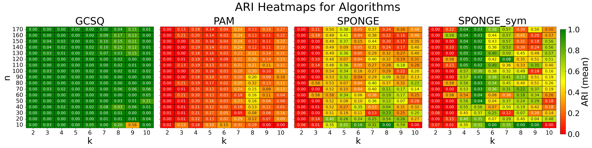
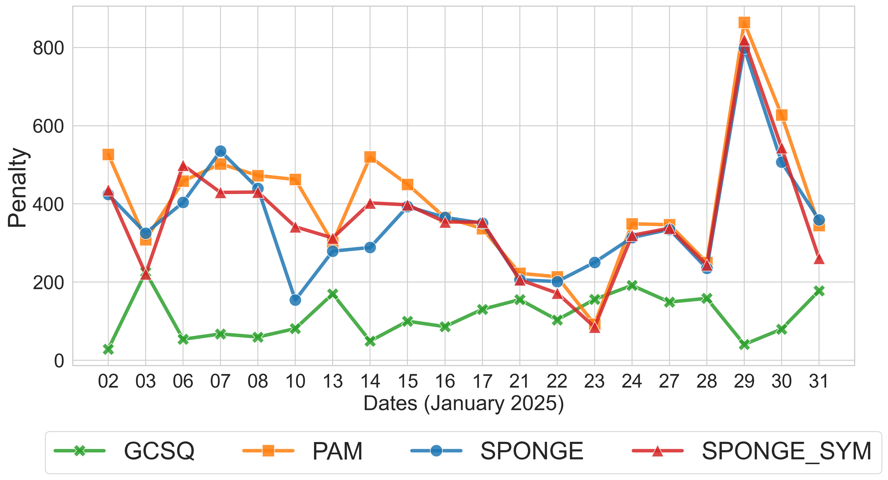

# Quantum Asset Clustering

<!-- [](https://doi.org/10.1007/978-3-031-97629-2_2)   -->
[](https://doi.org/10.48550/arXiv.2509.07766)  
[](https://conference-questis.org/)  
[](https://www.gnu.org/licenses/old-licenses/lgpl-2.1.html)  
[](https://www.linkedin.com/in/supreethmv/)  
[](https://www.supreethmv.com)

This repository contains the code for the research paper: 

**"Toward Quantum Utility in Finance: A Robust Data-Driven Algorithm for Asset Clustering"**

Accepted for an oral presentation and publication in the proceedings of **1st International Quantum Engineering Conference and Exhibition (QUEST-IS 2025)**, held in Paris, France.

📄 **Preprint Available**: [arXiv:2509.07766](https://arxiv.org/abs/2509.07766)

---

## 🚀 Overview
This repository contains the code and resources to reproduce the experiments and generate the plots presented in the paper. The methodology leverages the **GCS-Q algorithm**, originally designed for graph coalition structure generation, and adapts it for the novel use case of **financial asset clustering**. By solving the problem as **signed graph clustering**, specifically **correlation clustering**, this work demonstrates the potential of quantum computing in finance.

---

## 🧠 Key Highlights

### 1. **Quantum Advantage in Finance**
- **First Demonstration**: This work is the first to showcase quantum advantage in solution quality for asset clustering using real quantum hardware.
- **Exploring a Vast Solution Space**: GCS-Q explores an exponential solution space at each iteration, making it robust for heterogeneous cluster sizes.

### 2. **GCS-Q Algorithm**
- **Complexity**: Classical execution has a complexity of $\mathcal{O}(n2^n)$, where $\mathcal{O}(2^n)$ stems from solving the minimum cut and $\mathcal{O}(n)$ from dynamically determining $k \in [1,n]$.
- **Robustness**: Handles real-world scenarios with heterogeneous cluster sizes and avoids idealized constraints like uniform clusters or ternary edge weights.
- **Data-Driven**: Operates without manual tuning of $k$, preserving the relational structure of signed graphs.

### 3. **Quantum Hardware Integration**
- **D-Wave Quantum Annealer**: Utilizes D-Wave's hardware for solving QUBOs, with per-QUBO solve times capped at 1 second.
- **Scalability**: Successfully clusters up to 170 assets with $k=10$ in under 10 minutes, despite hardware noise and cloud latency on `D-wave Advantage 2.1`. 
Newer hardware topologies with more couplers between the physical qubits of the quantum annealer would allow to scale further.

### 4. **Comparison with Classical Methods**
- **Direct Signed Graph Clustering**: Unlike classical methods that convert signed correlations to Euclidean distances, GCS-Q works directly on signed graphs.
- **Benchmarks**: Outperforms classical solvers like Gurobi and CPLEX on dense graphs and varying-sized clusters.

---

## 📊 Repository Structure

```
Quantum-Asset-Clustering/
├── synthetic-data-experiments.ipynb   # Experiments on synthetic data
├── real-data-experiments.ipynb        # Experiments on real financial data
├── report.csv                         # Results from synthetic experiments
├── real_data_results_2025_Jan.csv     # Results from real data experiments
├── clustering_penalties.png           # Visualization of clustering penalties (Fig. 2 in paper)
├── heatmap_ARI.png                    # Heatmap of ARI metrics (Fig. 1 in paper)
├── requirements.txt                   # Python dependencies
└── README.md                          # This file
```

---

## 🔧 Installation

1. Clone the repository:
   ```bash
   git clone https://github.com/supreethmv/Quantum-Asset-Clustering.git
   cd Quantum-Asset-Clustering
   ```

2. Install the required dependencies:
   ```bash
   pip install -r requirements.txt
   ```

3. Ensure you have access to a D-Wave quantum annealer and store up your API token in a file named `dwave-api-token.txt`.

---

## 📂 Usage

### Synthetic Data Experiments
Run the notebook `synthetic-data-experiments.ipynb` to reproduce the synthetic data experiments and generate the heatmap comparision of GCS-Q, PAM, SPONGE and SPONGE_sym (Fig. 1 in the paper).

### Real Data Experiments
Run the notebook `real-data-experiments.ipynb` to analyze real financial data and evaluate the clustering performance.

---

## 📈 Results

### Synthetic Data
- **ARI Heatmap**: 

### Real Data
- Results are saved in `real_data_results_2025_Jan.csv`.
- **Clustering Penalties**: 

---

## 📝 Citation
If you use this repository, please cite our paper:

```
@inproceedings{quantum_asset_clustering,
  title={Toward Quantum Utility in Finance: A Robust Data-Driven Algorithm for Asset Clustering},
  author={SHivam Sharma, Supreeth Mysore Venkatesh, Pushkin Kachroo},
  booktitle={Proceedings of the 1st International Quantum Engineering Conference and Exhibition (QUEST-IS 2025)},
  year={2025},
  eprint={2509.07766},
  archivePrefix={arXiv},
  primaryClass={quant-ph},
  url={https://arxiv.org/abs/2509.07766}
}
```

---

## 🤝 Contributing
Contributions are welcome! Feel free to open issues or submit pull requests.

---

## **Contact**

**Supreeth Mysore Venkatesh**  

For any inquiries, please reach out to:

- Email: contact@supreethmv.com  
- LinkedIn: [Supreeth Mysore Venkatesh](https://www.linkedin.com/in/supreethmv/)  
- Website: [www.supreethmv.com](https://www.supreethmv.com)


## Contributors

<!-- [](https://www.supreethmv.com) -->
[](https://www.supreethmv.com)